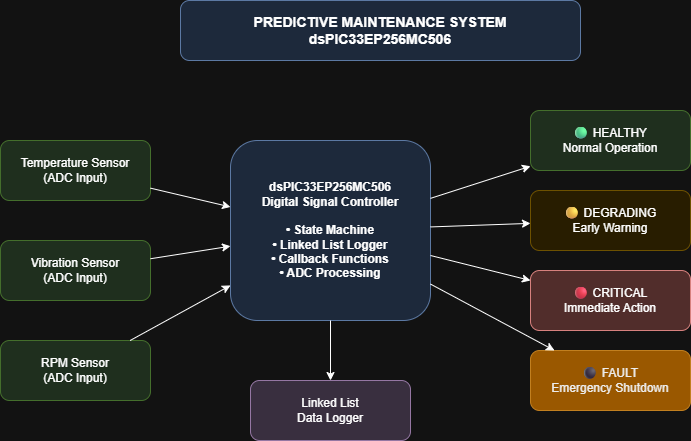
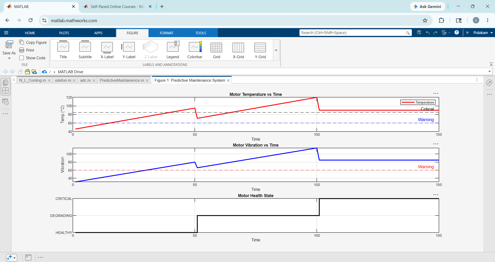

# 🏭 Predictive Maintenance System for Industrial Motors

Embedded systems firmware developed during **Microchip Technology Virtual Internship – Embedded Systems (13 Courses)**. Monitors industrial motor health in real-time using temperature, vibration and RPM sensors on **dsPIC33EP256MC506 Digital Signal Controller**.

---

## 🏗️ System Architecture





---

## 📊 MATLAB Simulation Results





---

## 🚦 Motor Health States
| State | Condition | Temperature | Action |
|-------|-----------|-------------|--------|
| 🟢 HEALTHY | Normal Operation | < 60°C | Continue |
| 🟡 DEGRADING | Early Warning | 60-70°C | Monitor |
| 🔴 CRITICAL | Immediate Action | 70-85°C | Maintain |
| ⚫ FAULT | Emergency Shutdown | > 85°C | Stop |

---

## 🛠️ Tools & Technologies
| Tool | Purpose |
|------|---------|
| MPLAB X IDE v6.30 | Development Environment |
| XC-DSC Compiler v3.31 | C Compiler for dsPIC |
| dsPIC33EP256MC506 | Digital Signal Controller |
| MPLAB X Simulator | Firmware Simulation |
| MATLAB Online | Data Visualization |
| draw.io | System Architecture |

---

## ⚙️ Key Features
- ✅ 4-State Health State Machine
- ✅ ADC-Based Sensor Simulation
- ✅ Linked List Data Structures
- ✅ Callback Functions
- ✅ UART Data Logging
- ✅ Real-time MATLAB Visualization

---

## 📁 Project Structure
```c
├── main.c              → Main program entry point
├── sensors.c           → Sensor reading & ADC simulation
├── sensors.h           → Sensor definitions & thresholds
├── statemachine.c      → Health state machine logic
├── statemachine.h      → State definitions & callbacks
├── datalogger.c        → Linked list data logger
├── datalogger.h        → Data structure definitions
├── matlab_simulation.png    → Simulation results
└── system_architecture.drawio.png → System diagram
```

---

## 📚 Concepts Implemented
- State Machine Design 
- Advanced C Programming 
- Linked List Data Structures 
- Callback Functions 
- Advanced Embedded C Tips 
- IoT Design Principles 
- Motor Control Concepts 

---

## 🏢 Internship
**Microchip Technology Virtual Internship**
Embedded Systems Track | 13 Courses Completed

---

## 👩‍💻 Developer
**Polakam Hema Sri**

B.Tech Electronics & Communication Engineering

Velagapudi Ramakrishna Siddhartha Engineering College (VRSEC), Vijayawada

🔗 [LinkedIn](https://linkedin.com/in/hema-sri-polakam-4957a0319)
🐙 [GitHub](https://github.com/PolakamHemaSri)
